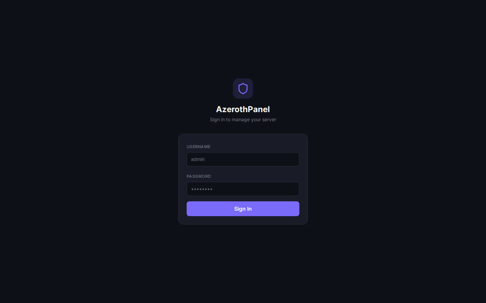
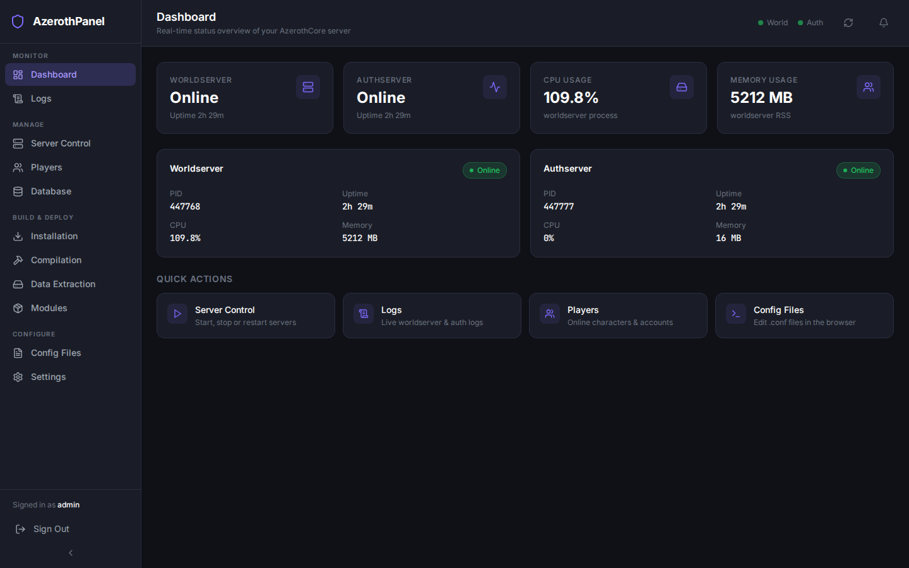

# AzerothPanel

A modern, web-based management panel for [AzerothCore](https://www.azerothcore.org/) WoW private servers.

AzerothPanel wraps everything a server administrator needs — start/stop servers, manage players, run GM commands, tail logs in real time, query databases, trigger builds, and configure the entire AzerothCore installation — into a clean React UI backed by a FastAPI REST + WebSocket API.

---

## Features

| Category | Capabilities |
|---|---|
| **Server Control** | Start, stop & restart worldserver / authserver; SOAP command execution; in-game server announcements |
| **Player Management** | List online players, browse accounts & characters, ban/unban accounts, kick players, bulk announcements, character stat modification |
| **Log Viewer** | Real-time log streaming (WebSocket), paginated log history, log download, multiple log sources |
| **Database Manager** | Browse world/auth/characters databases, execute SQL queries (read-only safety checks), table browser, database backup |
| **Compiler** | Trigger AzerothCore CMake builds with streaming SSE progress output, view build status |
| **Installer** | Run the AzerothCore data installation steps with live progress, read/edit `worldserver.conf` and `authserver.conf` in-browser |
| **Data Extraction** | Download pre-extracted client data from AzerothCore releases, or extract from local WoW 3.3.5a client (DBC, Maps, VMaps, MMaps) |
| **Module Manager** | Browse, install, and remove AzerothCore modules from the community catalogue |
| **Config Editor** | In-browser syntax-highlighted editor for `worldserver.conf`, `authserver.conf`, and installed module configs |
| **Settings** | Configure all AzerothCore paths, MySQL credentials, SOAP endpoint, and connection test — entirely UI-driven; no `.env` edits required after initial setup |
| **Backup & Restore** | Back up config files, databases, and server binaries/data to Local, SFTP/FTP, AWS S3, Google Drive, or OneDrive; restore from any archived backup with SSE progress streaming |
| **Authentication** | JWT bearer tokens, single admin user, configurable session length |

---

## Screenshots

<table>
<tr>
  <td align="center"><strong>Login</strong><br></td>
  <td align="center"><strong>Dashboard</strong><br></td>
</tr>
<tr>
  <td align="center"><strong>Server Control</strong><br></td>
  <td align="center"><strong>Player Management</strong><br></td>
</tr>
<tr>
  <td align="center"><strong>Log Viewer</strong><br></td>
  <td align="center"><strong>Database Manager</strong><br></td>
</tr>
<tr>
  <td align="center"><strong>Module Manager</strong><br></td>
  <td align="center"><strong>Config Editor</strong><br></td>
</tr>
<tr>
  <td align="center"><strong>Compilation</strong><br></td>
  <td align="center"><strong>Installation & Setup</strong><br></td>
</tr>
<tr>
  <td align="center"><strong>Data Extraction</strong><br></td>
  <td align="center"><strong>Settings</strong><br></td>
</tr>
</table>

---

## Architecture

```
┌─────────────────────────────────────┐
│           Browser (React)           │
│  Vite · TypeScript · Tailwind CSS   │
│  Zustand state · React Router       │
└──────────────┬──────────────────────┘
               │  HTTP /api/    WebSocket /ws/
               ▼
┌─────────────────────────────────────┐
│          nginx (port 80)            │
│  static files + reverse proxy       │
└──────────────┬──────────────────────┘
               │  host.docker.internal:8000
               ▼
┌─────────────────────────────────────┐
│         FastAPI (port 8000)         │
│  REST API v1 · WebSocket logs       │
│  SQLite (panel.db) · JWT auth       │
└──────────────┬──────────────────────┘
               │  direct process / file / MySQL access
               ▼
┌─────────────────────────────────────┐
│     AzerothCore (host machine)      │
│  worldserver · authserver · MySQL   │
└─────────────────────────────────────┘
```

The backend container runs with `network_mode: host` so it can reach AzerothCore processes, MySQL, and the SOAP interface that bind to `127.0.0.1` on the host. The frontend container communicates back to the backend via `host.docker.internal`.

---

## Quick Start

### Prerequisites

- Docker & Docker Compose v2
- AzerothCore installed on the host (default path `/opt/azerothcore`)
- MySQL/MariaDB with the AzerothCore databases accessible from the host

### 1 — Clone the repository

```bash
git clone https://github.com/scarecr0w12/AzerothPanel.git
cd AzerothPanel
```

### 2 — Configure environment

```bash
cp .env.example .env
cp backend/.env.example backend/.env
```

Edit `backend/.env` at minimum:

```dotenv
SECRET_KEY=<output of: openssl rand -hex 32>
PANEL_ADMIN_USER=admin
PANEL_ADMIN_PASSWORD=change_me
```

Edit `.env` if AzerothCore is not at `/opt/azerothcore` or you want a different port:

```dotenv
AC_PATH=/opt/azerothcore
PANEL_PORT=80
```

### 3 — Start the panel

```bash
make docker-up
# or
docker compose up --build -d
```

Open [http://localhost](http://localhost) (or the port you set in `PANEL_PORT`).

### 4 — Initial setup

Log in with the admin credentials from `backend/.env`, then navigate to **Settings** to configure:


- AzerothCore installation path
- MySQL host/port/user/password for each database (world, auth, characters)
- SOAP host/port/user/password for in-game command execution


Use **Test Connection** to verify each database before saving.

---

## Configuration

See [docs/configuration.md](docs/configuration.md) for a full reference of all environment variables and in-panel settings.

---

## Development

See [docs/development.md](docs/development.md) for local dev setup without Docker.

---

## API Reference

The backend exposes a versioned REST API at `/api/v1` and a WebSocket endpoint at `/ws/logs`. Interactive Swagger docs are available at [http://localhost:8000/docs](http://localhost:8000/docs) when running.

See [docs/api.md](docs/api.md) for a complete endpoint reference.

---

## Make Targets

```
make install        Install all dependencies (backend + frontend)
make dev            Run backend + frontend in development mode (no Docker)
make backend        Run only the FastAPI backend on :8000
make frontend       Run only the Vite dev server on :5173
make lint           TypeScript type-check

make docker-build   Build Docker images (no cache)
make docker-up      Build & start containers in background
make docker-down    Stop and remove containers
make docker-logs    Tail logs from all containers
make docker-restart Rebuild & restart all containers
```

---

## Project Structure

```
AzerothPanel/
├── docker-compose.yml         # Production deployment
├── nginx.conf                 # Reverse proxy / static file config
├── Makefile                   # Developer shortcuts
├── .env.example               # Docker Compose variables
│
├── backend/                   # FastAPI application
│   ├── Dockerfile
│   ├── requirements.txt
│   └── app/
│       ├── main.py            # Application factory, CORS, lifespan
│       ├── api/v1/
│       │   ├── router.py      # Route aggregation
│       │   └── endpoints/     # auth, server, players, logs, database,
│       │                      # installation, compilation, settings
│       ├── api/websockets/
│       │   └── logs.py        # Real-time log streaming
│       ├── core/
│       │   ├── config.py      # Pydantic Settings
│       │   ├── database.py    # SQLAlchemy async engine (panel DB)
│       │   └── security.py    # JWT helpers
│       ├── models/
│       │   ├── panel_models.py # SQLAlchemy ORM models
│       │   └── schemas.py     # Pydantic request/response schemas
│       └── services/
│           ├── panel_settings.py         # Settings CRUD
│           └── azerothcore/
│               ├── server_manager.py     # Process control (start/stop)
│               ├── compiler.py           # CMake build runner
│               ├── installer.py          # Data installation steps
│               └── soap_client.py        # SOAP RPC client
│
└── frontend/                  # React + TypeScript
    ├── Dockerfile             # Multi-stage build → nginx
    ├── vite.config.ts
    └── src/
        ├── pages/             # Dashboard, ServerControl, Players, Logs,
        │                      # DatabaseManager, Compilation, Installation,
        │                      # Settings, Login
        ├── components/        # Layout (Header/Sidebar) + UI primitives
        ├── services/api.ts    # Axios instance + typed API helpers
        ├── store/index.ts     # Zustand global store
        ├── hooks/             # useWebSocket, useServerStatus
        └── types/index.ts     # Shared TypeScript interfaces
```

---

## Security Notes

- **Change the default credentials** (`PANEL_ADMIN_USER` / `PANEL_ADMIN_PASSWORD`) before exposing the panel to any network.
- **Generate a strong `SECRET_KEY`**: `openssl rand -hex 32`
- The panel is designed for **trusted private network use**. Do not expose port 80 to the public internet without additional protection (firewall, VPN, reverse-proxy with TLS).
- SQL queries executed through the Database Manager are subject to a server-side read-only safety check (blocks `INSERT`, `UPDATE`, `DELETE`, `DROP`, `TRUNCATE`).

---

## License

MIT — see [LICENSE](LICENSE).

---

## Acknowledgements

- [AzerothCore](https://www.azerothcore.org/) — the open-source WoW emulator this panel is built for
- [FastAPI](https://fastapi.tiangolo.com/) — backend framework
- [React](https://react.dev/) + [Vite](https://vitejs.dev/) — frontend toolchain
- [Tailwind CSS](https://tailwindcss.com/) — utility-first styling
