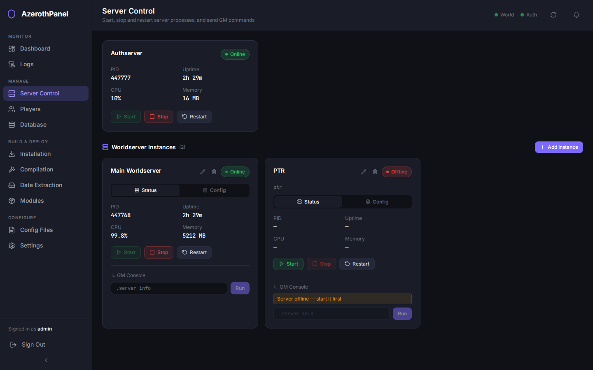
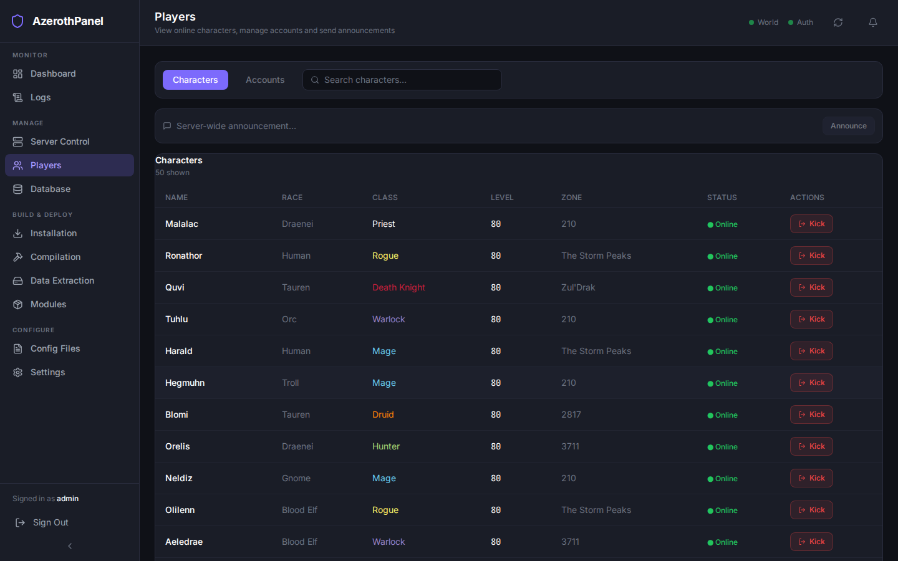
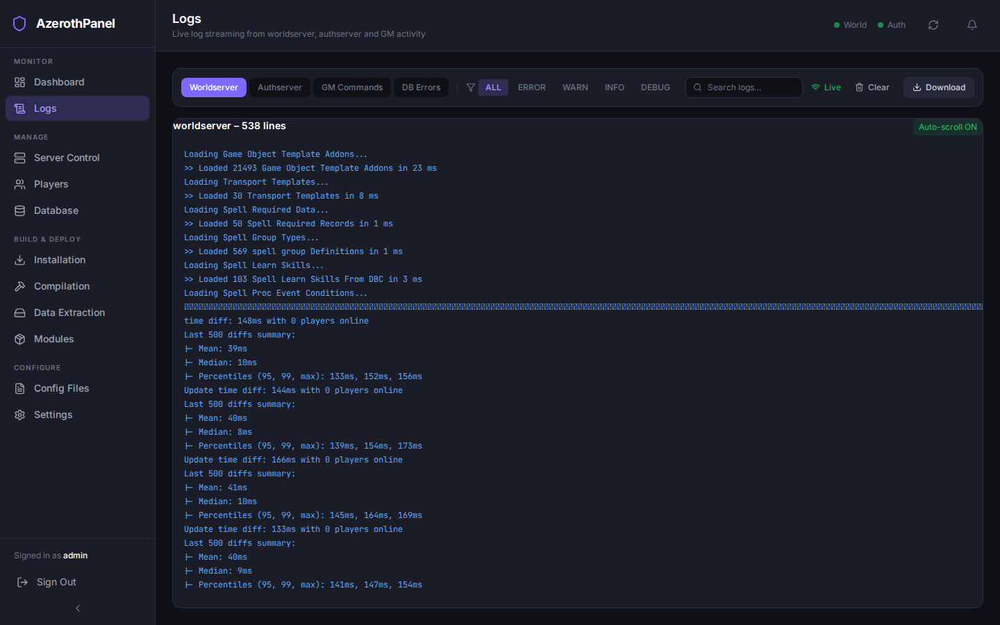
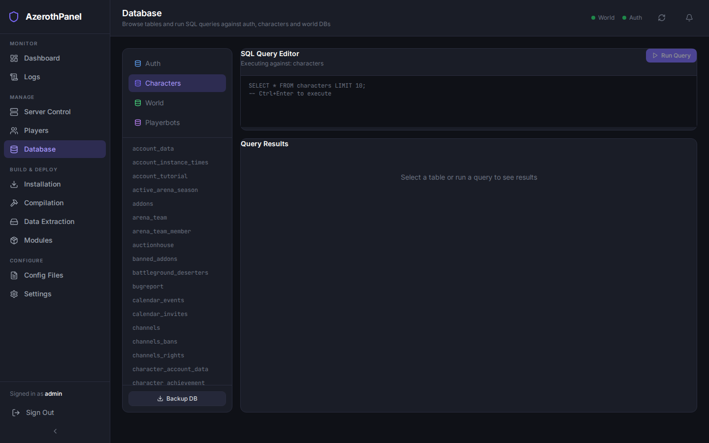
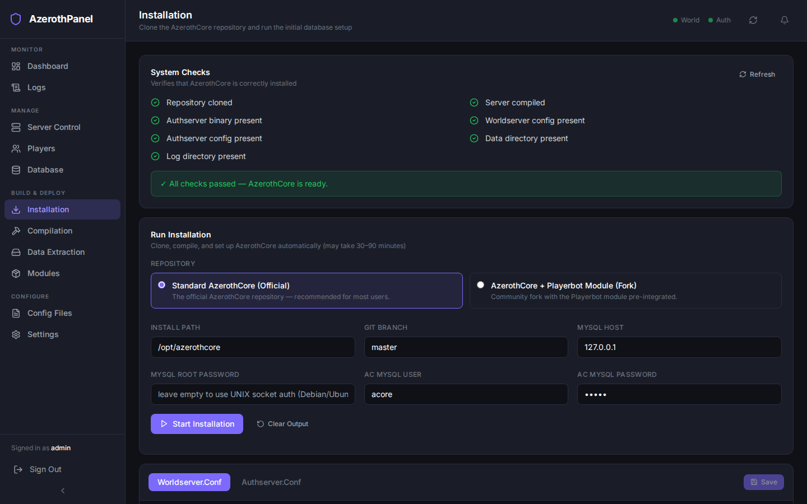
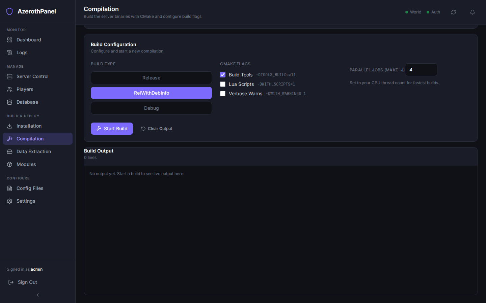
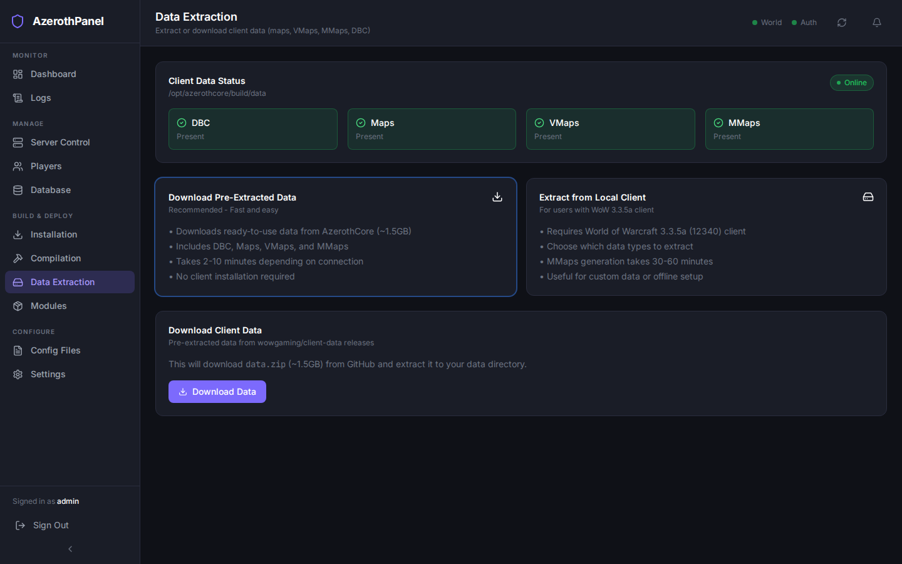
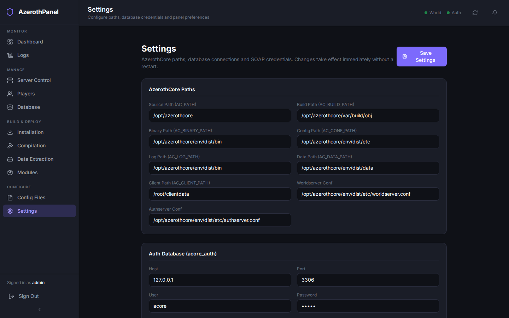
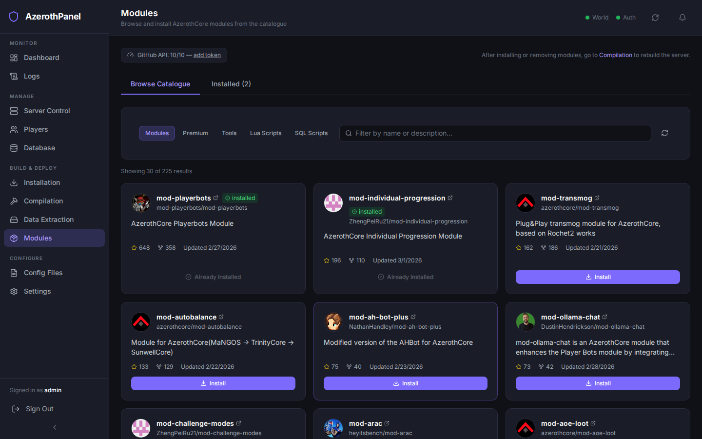
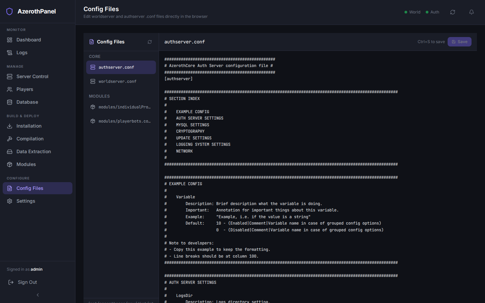

# API Reference

The AzerothPanel backend exposes a versioned REST API and a WebSocket endpoint.

- **Base URL**: `http://<host>:8000`
- **API prefix**: `/api/v1`
- **Interactive docs (Swagger UI)**: `http://<host>:8000/docs`
- **Alternative docs (ReDoc)**: `http://<host>:8000/redoc`

The sections below describe each endpoint group alongside the corresponding panel UI.

---

## Authentication

All endpoints except `/api/v1/auth/login` and `/api/v1/auth/login/json` require a **JWT Bearer token**.

### Obtain a token

```http
POST /api/v1/auth/login
Content-Type: application/x-www-form-urlencoded

username=admin&password=your_password
```

```http
POST /api/v1/auth/login/json
Content-Type: application/json

{"username": "admin", "password": "your_password"}
```

Response:

```json
{
  "access_token": "eyJ...",
  "token_type": "bearer"
}
```

### Use the token

Pass the token in the `Authorization` header on every subsequent request:

```
Authorization: Bearer eyJ...
```

---

## Endpoints

### Authentication — `/api/v1/auth`

| Method | Path | Description |
|---|---|---|
| `POST` | `/login` | Login via form body, returns JWT |
| `POST` | `/login/json` | Login via JSON body, returns JWT |
| `GET` | `/me` | Returns current user info |

---

### Server Control — `/api/v1/server`



| Method | Path | Description |
|---|---|---|
| `GET` | `/status` | Worldserver & authserver running status, PID, CPU %, memory. Queries the host daemon when available; falls back to psutil when daemon is absent. |
| `POST` | `/worldserver/start` | Start the worldserver process |
| `POST` | `/worldserver/stop` | Stop the worldserver process |
| `POST` | `/worldserver/restart` | Restart the worldserver process |
| `POST` | `/authserver/start` | Start the authserver process |
| `POST` | `/authserver/stop` | Stop the authserver process |
| `POST` | `/authserver/restart` | Restart the authserver process |
| `POST` | `/command` | Execute an arbitrary GM command via SOAP |
| `GET` | `/info` | Server host information (CPU, memory, uptime) |
| `POST` | `/announce` | Send a global in-game announcement via SOAP |

#### `POST /api/v1/server/command`

```json
{ "command": "server info" }
```

Response:

```json
{ "result": "AzerothCore rev. ...\nConnected players: 3\n..." }
```

---

### Worldserver Instances — `/api/v1/server/instances`

Manage multiple independent worldserver processes from a single panel. Each instance has its own binary path, working directory, and `worldserver.conf`.


| Method | Path | Description |
|---|---|---|
| `GET` | `/server/instances` | List all instances with live process status |
| `POST` | `/server/instances` | Create a new instance |
| `GET` | `/server/instances/{id}` | Get one instance with live status |
| `PUT` | `/server/instances/{id}` | Update instance metadata |
| `DELETE` | `/server/instances/{id}` | Stop (if running) then delete the instance |
| `POST` | `/server/instances/{id}/start` | Start the instance's worldserver process |
| `POST` | `/server/instances/{id}/stop` | Stop the instance's worldserver process |
| `POST` | `/server/instances/{id}/restart` | Restart the instance's worldserver process |
| `POST` | `/server/instances/{id}/command` | Send a GM console command via the daemon stdin pipe |
| `GET` | `/server/instances/{id}/config` | Read this instance's `worldserver.conf`; falls back to global `AC_WORLDSERVER_CONF` |
| `PUT` | `/server/instances/{id}/config` | Write updated content to this instance's `worldserver.conf` |
| `POST` | `/server/instances/{id}/generate-config` | Copy the global conf as a template, patch ports/realm/ID, write to `conf_output_path` |

#### `POST /api/v1/server/instances` — Create instance

```json
{
  "display_name": "PTR Realm",
  "process_name": "worldserver-ptr",
  "binary_path": "/opt/azerothcore/bin/worldserver",
  "working_dir": "/opt/azerothcore/bin",
  "notes": "Public test realm"
}
```

#### `POST /api/v1/server/instances/{id}/generate-config` — Provision a conf file

```json
{
  "conf_output_path": "/opt/azerothcore/etc/worldserver-ptr.conf",
  "realm_name": "PTR",
  "realm_id": 2,
  "worldserver_port": 8086,
  "instance_port": 8086,
  "ra_port": 3444
}
```

The endpoint copies the global `worldserver.conf` and patches the specified key=value pairs in-place. The instance's `conf_path` is updated in the database.

---

### Player Management — `/api/v1/players`



| Method | Path | Description |
|---|---|---|
| `GET` | `/online` | List currently online players (via SOAP) |
| `GET` | `/accounts` | List accounts with optional search/pagination |
| `GET` | `/characters` | List characters with optional search/pagination |
| `GET` | `/characters/{guid}` | Get a single character by GUID |
| `POST` | `/ban` | Ban an account by name with duration and reason |
| `POST` | `/unban/{account_id}` | Remove an account ban |
| `POST` | `/kick/{player_name}` | Kick an online player |
| `POST` | `/announce` | Send a message to all online players |
| `POST` | `/modify` | Modify a player's stats (level, gold, etc.) |

#### `GET /api/v1/players/accounts`

Query parameters:

| Param | Type | Description |
|---|---|---|
| `search` | `string` | Filter by username |
| `page` | `int` | Page number (default `1`) |
| `per_page` | `int` | Results per page (default `20`) |

#### `POST /api/v1/players/ban`

```json
{
  "account_name": "badplayer",
  "duration": "30d",
  "reason": "Cheating"
}
```

---

### Logs — `/api/v1/logs`



| Method | Path | Description |
|---|---|---|
| `GET` | `/sources` | List available log sources (worldserver, authserver, etc.) |
| `GET` | `/{source}` | Get last N lines of a log file |
| `GET` | `/{source}/size` | Get the file size of a log source |
| `GET` | `/{source}/download` | Download a log file as a file attachment |

#### `GET /api/v1/logs/{source}`

Query parameters:

| Param | Type | Description |
|---|---|---|
| `lines` | `int` | Number of tail lines to return (default `100`) |

---

### Database Manager — `/api/v1/database`



| Method | Path | Description |
|---|---|---|
| `GET` | `/available` | List queryable database targets (`auth`, `world`, `characters`; `playerbots` when `mod-playerbots` is installed) |
| `GET` | `/tables/{database}` | List tables in a database (`auth`, `world`, `characters`, `playerbots`) |
| `POST` | `/query` | Execute a SQL query (read-only safety check enforced) |
| `GET` | `/table/{database}/{table_name}` | Browse a table with pagination |
| `POST` | `/backup` | Initiate a database backup (mysqldump) |

> **Playerbots database**: The `playerbots` target is only included in `/available` (and accepted by all other endpoints) when `{AC_PATH}/modules/mod-playerbots` exists on disk. Requests using `playerbots` when the module is absent return HTTP 404.

#### `POST /api/v1/database/query`

```json
{
  "database": "world",
  "query": "SELECT entry, name FROM creature_template LIMIT 10"
}
```

> **Note**: Writes (`INSERT`, `UPDATE`, `DELETE`, `DROP`, `TRUNCATE`) are rejected server-side.

---

### Installation — `/api/v1/installation`



| Method | Path | Description |
|---|---|---|
| `GET` | `/status` | Latest installation step status |
| `POST` | `/run` | Start the AzerothCore data installation (SSE stream) |
| `GET` | `/config/worldserver` | Read `worldserver.conf` as key-value pairs |
| `PUT` | `/config/worldserver` | Write updated key-value pairs to `worldserver.conf` |
| `GET` | `/config/authserver` | Read `authserver.conf` as key-value pairs |
| `PUT` | `/config/authserver` | Write updated key-value pairs to `authserver.conf` |

The `/run` endpoint uses **Server-Sent Events (SSE)**. The client receives a stream of `data:` lines with installation progress until completion.

---

### Compilation — `/api/v1/compilation`



| Method | Path | Description |
|---|---|---|
| `GET` | `/status` | Current or last build status (idle / running / success / failed) |
| `POST` | `/build` | Trigger a CMake build (SSE stream of compiler output) |

> **Pull Latest Source** — The Compilation page also exposes a "Pull Latest Source" button that calls `POST /modules/update-azerothcore` (see Module Manager below). The rationale is that pulling updated source and then rebuilding are sequential steps that belong on the same page.

#### `POST /api/v1/compilation/build`

```json
{
  "cmake_options": "-DCMAKE_BUILD_TYPE=RelWithDebInfo",
  "cores": 4
}
```

The response is an **SSE stream** of build output lines.

---

### Data Extraction — `/api/v1/data-extraction`



| Method | Path | Description |
|---|---|---|
| `GET` | `/status` | Get extraction status and data presence |
| `POST` | `/download` | Download pre-extracted data from AzerothCore releases (SSE stream) |
| `POST` | `/extract` | Extract data from local WoW 3.3.5a client (SSE stream) |
| `POST` | `/cancel` | Cancel any running extraction operation |

#### `GET /api/v1/data-extraction/status`

Returns the current extraction status and which data types are present:

```json
{
  "in_progress": false,
  "current_step": null,
  "progress_percent": 0,
  "started_at": null,
  "error": null,
  "data_path": "/opt/azerothcore/build/data",
  "has_dbc": true,
  "has_maps": true,
  "has_vmaps": true,
  "has_mmaps": true,
  "data_present": true
}
```

#### `POST /api/v1/data-extraction/download`

Downloads pre-extracted client data from AzerothCore GitHub releases. This is the recommended method.

Request body (optional):

```json
{
  "data_path": "/custom/data/path",  // Optional, uses AC_DATA_PATH from settings
  "data_url": "https://..."          // Optional, uses default AzerothCore release URL
}
```

The response is an **SSE stream** of progress lines.

#### `POST /api/v1/data-extraction/extract`

Extracts client data from a local World of Warcraft 3.3.5a (12340) client.

Request body:

```json
{
  "client_path": "/path/to/wow-client",
  "data_path": "/opt/azerothcore/build/data",  // Optional
  "binary_path": "/opt/azerothcore/build/bin", // Optional
  "extract_dbc": true,
  "extract_maps": true,
  "extract_vmaps": true,
  "generate_mmaps": false  // Off by default due to long generation time
}
```

The response is an **SSE stream** of extraction progress lines.

---

### Settings — `/api/v1/settings`



| Method | Path | Description |
|---|---|---|
| `GET` | `` | Get all current panel settings |
| `PUT` | `` | Update panel settings |
| `POST` | `/test-db` | Test a MySQL connection with the supplied credentials |
| `GET` | `/panel-version` | Return current git tag, branch, commit hash, and how many commits HEAD is behind `origin/HEAD`. Requires the host daemon. |
| `POST` | `/update-panel` | Pull the latest code from GitHub and rebuild + restart Docker containers via the host daemon (long-running, up to 660 s). Returns `{"success": bool, "output": str}`. |

#### `GET /api/v1/settings`

Response:

```json
{
  "ac_path": "/opt/azerothcore",
  "mysql_auth_host": "127.0.0.1",
  "mysql_auth_port": 3306,
  "mysql_auth_user": "acore",
  "mysql_auth_db": "acore_auth",
  "soap_host": "127.0.0.1",
  "soap_port": 7878,
  ...
}
```

---

### Module Manager — `/api/v1/modules`



| Method | Path | Description |
|---|---|---|
| `GET` | `/catalogue` | List available modules from the AzerothCore GitHub catalogue |
| `GET` | `/installed` | List locally installed modules |
| `POST` | `/install` | Clone and install a module by repository slug |
| `POST` | `/update-azerothcore` | `git pull` the AzerothCore source tree (SSE stream) |
| `POST` | `/update-all` | `git pull` all installed git-tracked modules (SSE stream) |
| `POST` | `/{module_name}/update` | `git pull` a single installed module (SSE stream) |
| `DELETE` | `/{module_name}` | Remove an installed module |

---

### Config Editor — `/api/v1/configs`



| Method | Path | Description |
|---|---|---|
| `GET` | `/files` | List all editable `.conf` files |
| `GET` | `/files/{filename}` | Get the raw text content of a config file |
| `PUT` | `/files/{filename}` | Save updated content to a config file |

---

## WebSocket — Live Log Streaming

```
ws://<host>/ws/logs/{source}
```

Opens a persistent WebSocket connection that streams new log lines in real time as they are appended to the log file. Each message is a plain-text log line.

### Example (JavaScript)

```javascript
const ws = new WebSocket("ws://localhost/ws/logs/worldserver");
ws.onmessage = (event) => console.log(event.data);
```

---

## Health Check

```http
GET /health
```

Returns `{"status": "ok"}` with HTTP 200. No authentication required. Used by Docker health checks and load balancers.
