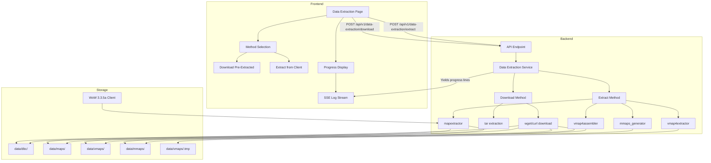
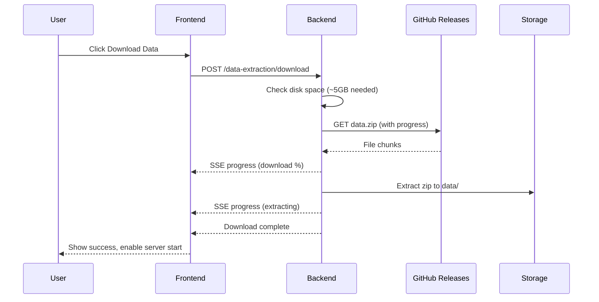
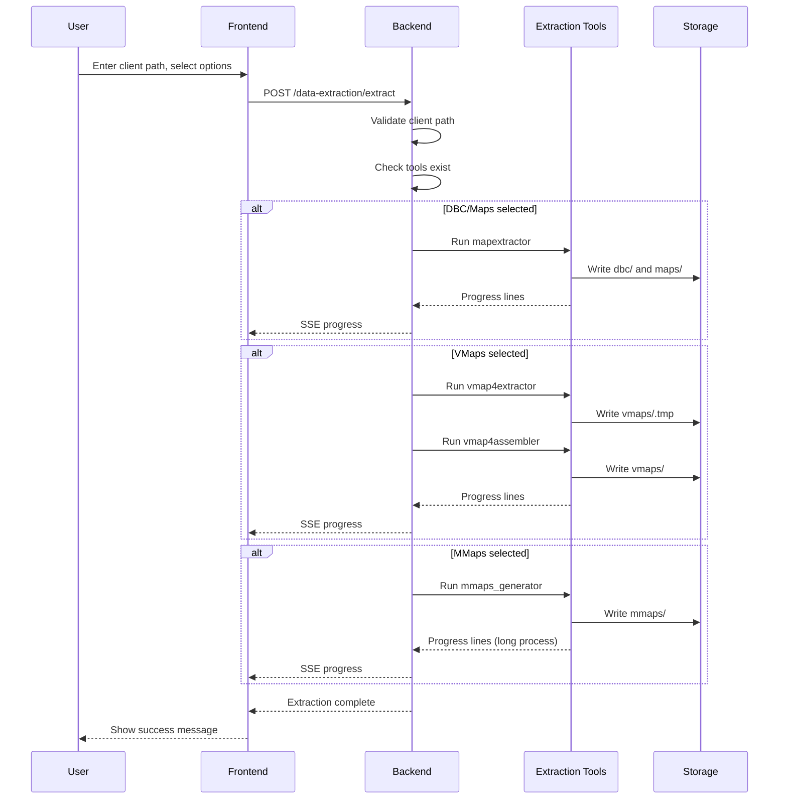

# Client Data Extraction Feature Plan

## Overview

AzerothCore requires client data files extracted from a World of Warcraft 3.3.5a (12340) client to run. The servers (worldserver and authserver) will fail to start without these files. This plan outlines adding a client data extraction feature to the AzerothPanel.

## Two Methods for Obtaining Data

### Method 1: Download Pre-Extracted Data (Recommended)
AzerothCore provides pre-extracted data files that can be downloaded directly. This is the fastest and easiest method, similar to what `acore.sh` does.

**Source**: https://github.com/wowgaming/client-data/releases
**Files**:
- `data.zip` - Contains DBC, Maps, VMaps, MMaps (pre-generated)
- Approximately 1.5GB download, extracts to ~5GB

### Method 2: Extract from Local Client
For users who have a WoW 3.3.5a client, they can extract data themselves. This is useful for custom data or if pre-extracted data is unavailable.

## Required Data Types

| Data Type | Tool | Output Directory | Purpose |
|-----------|------|------------------|---------|
| DBC Files | `mapextractor` | `data/dbc/` | Database client files (game data) |
| Maps | `mapextractor` | `data/maps/` | Map tile data |
| VMaps | `vmap4extractor` + `vmap4assembler` | `data/vmaps/` | Virtual maps (collision/LOS) |
| MMaps | `mmaps_generator` | `data/mmaps/` | Movement maps (pathfinding) |

## Extraction Tools

The tools are built during compilation and located at `{AC_BINARY_PATH}/`:
- `mapextractor` - Extracts DBC and map files
- `vmap4extractor` - Extracts vmap raw data
- `vmap4assembler` - Assembles vmap raw data into usable format
- `mmaps_generator` - Generates movement maps (takes longest time)

## Architecture



## Implementation Details

### 1. Backend Service: `backend/app/services/azerothcore/data_extractor.py`

```python
# Key functions:

# Method 1: Download pre-extracted data (recommended)
async def download_data(data_path: str) -> AsyncIterator[str]:
    """Download and extract pre-generated data from wowgaming/client-data releases."""
    # URL: https://github.com/wowgaming/client-data/releases/download/v19/data.zip
    # Uses wget/curl with progress output
    # Extracts to data_path using unzip

# Method 2: Extract from local client
async def extract_dbc_maps(client_path: str, output_path: str) -> AsyncIterator[str]
async def extract_vmaps(client_path: str, output_path: str) -> AsyncIterator[str]
async def generate_mmaps(client_path: str, output_path: str) -> AsyncIterator[str]
async def extract_all(client_path: str, output_path: str, options: dict) -> AsyncIterator[str]

# Status tracking
def get_extraction_status() -> ExtractionStatus
```

### 2. API Endpoints: `backend/app/api/v1/endpoints/data_extraction.py`

| Endpoint | Method | Description |
|----------|--------|-------------|
| `/api/v1/data-extraction/status` | GET | Get current extraction status |
| `/api/v1/data-extraction/download` | POST | Download pre-extracted data (SSE) |
| `/api/v1/data-extraction/extract` | POST | Extract from local client (SSE) |
| `/api/v1/data-extraction/cancel` | POST | Cancel running operation |

### 3. Request/Response Schemas

```python
class DownloadRequest(BaseModel):
    data_path: Optional[str] = None  # Uses AC_DATA_PATH from settings if not provided

class ExtractionOptions(BaseModel):
    extract_dbc: bool = True
    extract_maps: bool = True
    extract_vmaps: bool = True
    generate_mmaps: bool = True
    client_path: str  # Path to WoW 3.3.5a client

class ExtractionStatus(BaseModel):
    in_progress: bool
    current_step: Optional[str]
    progress_percent: Optional[int]
    started_at: Optional[datetime]
    error: Optional[str]
    data_present: bool  # True if data files exist
    has_dbc: bool
    has_maps: bool
    has_vmaps: bool
    has_mmaps: bool
```

### 4. Frontend Page: `frontend/src/pages/DataExtraction.tsx`

Features:
- **Method Selection**: Tabs or cards for "Download Data" vs "Extract from Client"
- **Download Tab**:
  - Shows data URL source
  - Single "Download Data" button
  - Progress bar with download speed
  - Estimated time: 2-10 minutes depending on connection
- **Extract Tab**:
  - Input field for WoW client path (with validation)
  - Checkboxes for extraction options (DBC, Maps, VMaps, MMaps)
  - Warning about MMaps time (30-60 minutes)
- **Common Features**:
  - Real-time progress log (SSE)
  - Cancel button
  - Status indicators showing which data is present
  - "Verify Data" button to check integrity

### 5. Settings Integration

Add new panel settings:
- `AC_CLIENT_PATH` - Path to WoW 3.3.5a client (can be set during extraction)
- `AC_DATA_URL` - URL for pre-extracted data (default: AzerothCore release)

## Download Process Flow (Recommended)



## Extraction Process Flow (Alternative)



## Time Estimates

| Method | Process | Estimated Time |
|--------|---------|----------------|
| **Download** | Download data.zip | 2-10 minutes |
| **Download** | Extract zip | 1-2 minutes |
| **Extract** | DBC + Maps extraction | 2-5 minutes |
| **Extract** | VMaps extraction | 10-20 minutes |
| **Extract** | MMaps generation | 30-60 minutes |

**Recommendation**: Use the download method for fastest setup. Only use extraction if you need custom data or have a slow internet connection.

## Error Handling

### Download Method
1. **Network error** - Retry with resume support (wget -c)
2. **Insufficient disk space** - Check available space (need ~5GB)
3. **Corrupted download** - Verify file size/hash, re-download
4. **Extraction failed** - Clean up partial files, retry

### Extraction Method
1. **Client path invalid** - Check for `Wow.exe` or `MacOS/World of Warcraft.app`
2. **Tools not found** - Verify compilation completed successfully
3. **Insufficient disk space** - Check available space (need ~5GB)
4. **Permission denied** - Ensure write permissions to data directory
5. **Extraction cancelled** - Clean up partial files

## Files to Create/Modify

### New Files
- `backend/app/services/azerothcore/data_extractor.py`
- `backend/app/api/v1/endpoints/data_extraction.py`
- `frontend/src/pages/DataExtraction.tsx`

### Modified Files
- `backend/app/api/v1/router.py` - Add data extraction router
- `backend/app/models/schemas.py` - Add extraction schemas
- `backend/app/services/panel_settings.py` - Add AC_CLIENT_PATH default
- `frontend/src/App.tsx` - Add route
- `frontend/src/components/layout/Sidebar.tsx` - Add navigation item
- `frontend/src/services/api.ts` - Add API functions

## Dependencies

- Existing SSE infrastructure from installation/compilation
- Existing settings system
- Existing log streaming via WebSocket

## Testing Checklist

### Download Method
- [ ] Verify download from GitHub releases works
- [ ] Verify tar.xz extraction completes successfully
- [ ] Test download resume after interruption
- [ ] Test with insufficient disk space
- [ ] Verify servers start after download

### Extraction Method
- [ ] Verify mapextractor works with valid client path
- [ ] Verify vmap4extractor + vmap4assembler work correctly
- [ ] Verify mmaps_generator completes successfully
- [ ] Test cancellation mid-extraction
- [ ] Test with invalid client path
- [ ] Test with missing extraction tools
- [ ] Verify servers start after extraction

### Integration
- [ ] Verify status endpoint shows correct data presence
- [ ] Verify frontend shows progress in real-time
- [ ] Verify cancel works for both methods
- [ ] Test full flow: install → compile → download data → start servers
