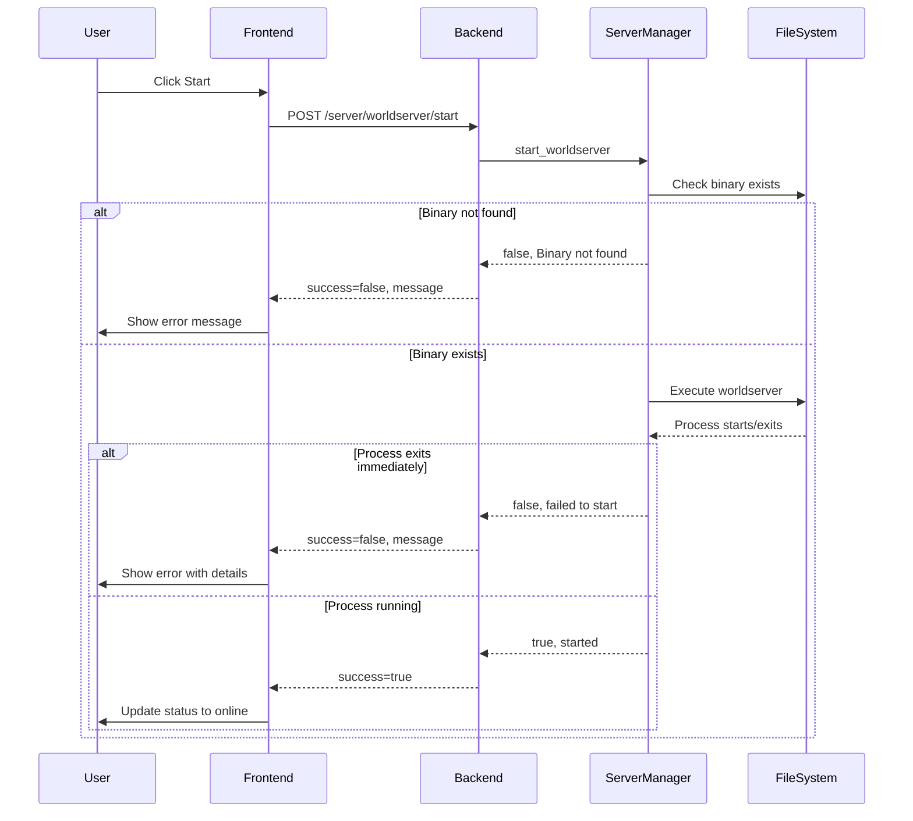

# Server Control Fix Plan

## Problem Summary
The server control functionality does not start worldserver and authserver processes. Clicking Start shows no response or error.

## Root Cause Analysis

After analyzing the code, I identified several issues:

### 1. Silent Failure - No Error Output Capture
In [`server_manager.py`](backend/app/services/azerothcore/server_manager.py:85-92), the subprocess is created with stdout and stderr redirected to DEVNULL:

```python
proc = await asyncio.create_subprocess_exec(
    binary,
    cwd=binary_path,
    env=env,
    stdout=asyncio.subprocess.DEVNULL,
    stderr=asyncio.subprocess.DEVNULL,
    start_new_session=True,
)
```

This means any startup errors (missing config files, database connection failures, etc.) are silently swallowed.

### 2. Incorrect Working Directory
The current code sets `cwd=binary_path` (the `bin` directory), but AzerothCore servers typically need to run from a directory where they can find their configuration files relative to their location. The servers look for config files in `../etc/` relative to the binary location.

### 3. No Prerequisite Validation
The code doesn't validate:
- Configuration files exist (`worldserver.conf`, `authserver.conf`)
- Database connectivity
- Required data files (DBC, maps, vmaps, mmaps)
- Proper file permissions

### 4. Frontend Doesn't Display Error Messages
The [`ServerControl.tsx`](frontend/src/pages/ServerControl.tsx) component doesn't display error messages returned from the backend API. The mutation hooks don't show the `message` field from `ServerActionResponse`.

## Architecture Flow



## Implementation Plan

### Phase 1: Backend Improvements

#### 1.1 Add Detailed Logging and Error Capture
- Modify `_launch()` to capture stderr output
- Add logging statements for debugging
- Return more descriptive error messages

#### 1.2 Add Prerequisite Validation
- Create a `validate_server_startup()` function to check:
  - Binary exists and is executable
  - Configuration files exist
  - Required directories (data, logs) exist
  - Database connection can be established (optional)

#### 1.3 Fix Working Directory
- Set the correct working directory for the server process
- AzerothCore servers should run from the binary directory but need proper config paths

#### 1.4 Add Startup Timeout and Verification
- Increase the startup wait time (currently 1.5s may be too short)
- Add process verification with better error handling
- Capture early exit status and reason

### Phase 2: Frontend Improvements

#### 2.1 Display Error Messages
- Add toast/notification system to show success/error messages
- Display the `message` field from `ServerActionResponse`

#### 2.2 Add Loading States
- Show loading indicator during server operations
- Disable buttons appropriately during operations

#### 2.3 Add Server Logs Preview
- Show recent server logs when startup fails
- Help users diagnose issues

### Phase 3: Testing

#### 3.1 Manual Testing Checklist
- [ ] Start worldserver from UI
- [ ] Stop worldserver from UI
- [ ] Restart worldserver from UI
- [ ] Start authserver from UI
- [ ] Stop authserver from UI
- [ ] Restart authserver from UI
- [ ] Verify error messages display correctly
- [ ] Test with missing binaries
- [ ] Test with missing config files
- [ ] Test with database unavailable

## Files to Modify

| File | Changes |
|------|---------|
| `backend/app/services/azerothcore/server_manager.py` | Add logging, error capture, validation, fix working directory |
| `backend/app/api/v1/endpoints/server.py` | Add validation endpoint, improve error responses |
| `frontend/src/pages/ServerControl.tsx` | Add error message display, toast notifications |
| `frontend/src/hooks/useServerStatus.ts` | Add success/error callbacks with notifications |
| `frontend/src/services/api.ts` | Add validation endpoint call |

## Detailed Code Changes

### server_manager.py Changes

1. **Add logging import and setup**
2. **Capture stderr in a temp file or pipe**
3. **Add prerequisite checks**
4. **Improve error messages**
5. **Add startup verification with timeout**

### Frontend Changes

1. **Add a toast/notification component**
2. **Update ServerControl to show operation results**
3. **Add error boundary for better error handling**

## Success Criteria

1. Clicking Start on worldserver/authserver shows immediate feedback
2. If startup fails, a clear error message is displayed
3. If startup succeeds, status updates to show the server is running
4. Logs are available to diagnose startup failures
5. All server operations (start/stop/restart) work reliably
