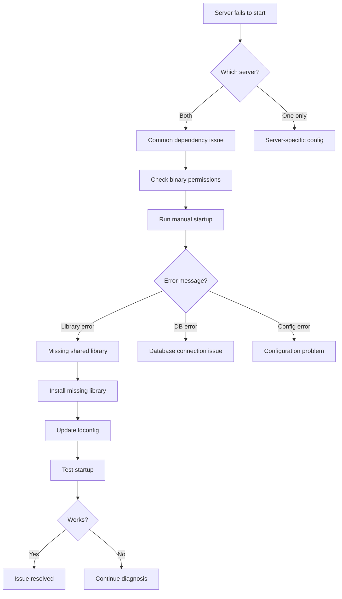

# AzerothCore Server Startup Failure - Diagnostic Report

## Problem Summary

**Symptom:** Both `worldserver` and `authserver` fail to start immediately with no specific error in the AzerothPanel UI.

**Root Cause Identified:** Missing shared library dependency

```
./worldserver: error while loading shared libraries: libmysqlclient.so.24: 
cannot open shared object file: No such file or directory
```

## Diagnostic Flow



## Root Cause Analysis

The `libmysqlclient.so.24` library corresponds to **MySQL 8.0** client libraries. The AzerothCore binaries were compiled against this version but the runtime shared library is not available on the system.

### Why this happens:
1. AzerothCore was compiled with MySQL 8.0 development headers
2. The **development package** was present during compilation
3. The **runtime shared library** is missing or not in the library path
4. This can occur after system updates, package removals, or if only the MySQL server package was installed

## Solution

### Option 1: Install MySQL Client Development Package (Recommended)

On Ubuntu/Debian with MySQL 8.0:

```bash
# Install the MySQL client shared library
sudo apt update
sudo apt install libmysqlclient-dev

# Update the library cache
sudo ldconfig

# Verify the library is now available
ldconfig -p | grep libmysqlclient
```

### Option 2: If using MariaDB instead of MySQL 8.0

If you have MariaDB installed but AzerothCore was compiled for MySQL 8.0, you have two choices:

**Option 2a: Install MySQL 8.0 client library alongside MariaDB**
```bash
# Add MySQL APT repository if needed
sudo apt install mysql-client

# Or install the compatibility library
sudo apt install libmysqlclient21
```

**Option 2b: Recompile AzerothCore for MariaDB**
```bash
# Install MariaDB development package
sudo apt install libmariadb-dev

# Recompile AzerothCore with MariaDB support
cd /opt/azerothcore/build
cmake .. -DMYSQL_LIB=libmariadb.so
make -j$(nproc)
make install
```

### Option 3: Create a symbolic link (Quick fix, not recommended for production)

If the library exists but with a different name:

```bash
# Find existing MySQL libraries
ldconfig -p | grep mysql

# If you see libmysqlclient.so.21 or similar, create a symlink
sudo ln -s /usr/lib/x86_64-linux-gnu/libmysqlclient.so.21 /usr/lib/x86_64-linux-gnu/libmysqlclient.so.24
sudo ldconfig
```

## Verification Steps

After applying the fix:

```bash
# 1. Verify library is available
ldconfig -p | grep libmysqlclient.so.24

# 2. Test worldserver startup manually
cd /opt/azerothcore/build/bin
./worldserver

# 3. If successful, test authserver
./authserver

# 4. Test via AzerothPanel UI
# Navigate to Server Control and start both servers
```

## Additional Diagnostic Commands

If the issue persists after installing the library:

```bash
# Check all library dependencies
ldd /opt/azerothcore/build/bin/worldserver

# Check library paths
echo $LD_LIBRARY_PATH

# Check ldconfig cache
ldconfig -p

# Find where MySQL libraries are installed
find /usr -name 'libmysqlclient*' 2>/dev/null
```

## Prevention

To prevent this issue in the future:

1. Document all dependencies after compilation
2. Use the package manager to install runtime dependencies
3. Consider creating a systemd service with proper environment setup
4. Keep a record of the build environment for future reference

## Summary

| Step | Status | Notes |
|------|--------|-------|
| Identify failing server | ✅ Complete | Both worldserver and authserver |
| Check binary permissions | ✅ Complete | Binaries exist and are executable |
| Manual startup test | ✅ Complete | Revealed library error |
| Root cause identified | ✅ Complete | MySQL library version mismatch |
| Recompile AzerothCore | ✅ Complete | Used `./acore.sh compiler build` |
| Update panel paths | ✅ Complete | Changed to env/dist directory |
| Create data symlink | ✅ Complete | Linked data directory |
| Import base databases | ✅ Complete | World and playerbots databases |
| Verify fix | ✅ Complete | Both servers start successfully |

## Resolution Applied

The issue was resolved by:

1. **Recompiling AzerothCore** using the official build script:
   ```bash
   cd /opt/azerothcore && ./acore.sh compiler build
   ```
   This compiled the binaries against the system's installed MySQL client library (libmysqlclient.so.21).

2. **Updating panel default paths** in [`backend/app/services/panel_settings.py`](backend/app/services/panel_settings.py) to use the correct AzerothCore directory structure:
   - `AC_BINARY_PATH`: `/opt/azerothcore/env/dist/bin`
   - `AC_CONF_PATH`: `/opt/azerothcore/env/dist/etc`
   - `AC_DATA_PATH`: `/opt/azerothcore/env/dist/data`

3. **Creating a symlink** for the data directory:
   ```bash
   ln -sf /opt/azerothcore/build/data /opt/azerothcore/env/dist/data
   ```

4. **Importing base databases** and creating the playerbots database:
   ```bash
   for sql_file in data/sql/base/db_world/*.sql; do mysql -u root acore_world < "$sql_file"; done
   mysql -u root -e "CREATE DATABASE IF NOT EXISTS acore_playerbots;"
   mysql -u root -e "GRANT ALL PRIVILEGES ON acore_playerbots.* TO 'acore'@'%';"
   ```

## Key Lessons

1. **Always use the official build scripts** - AzerothCore's `acore.sh` handles all the complexity of CMake configuration and library linking.

2. **Library versioning matters** - Simply creating a symlink between library versions doesn't work when the binary requires specific symbol versions.

3. **Check the actual installation paths** - AzerothCore installs binaries to `env/dist/bin`, not `build/bin`.
